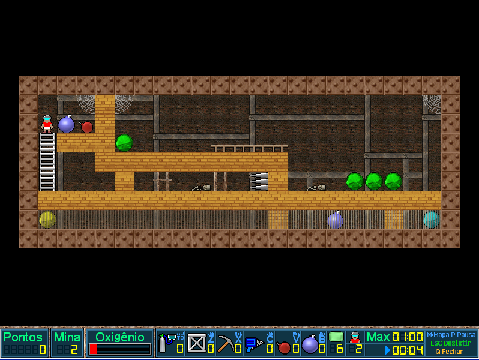
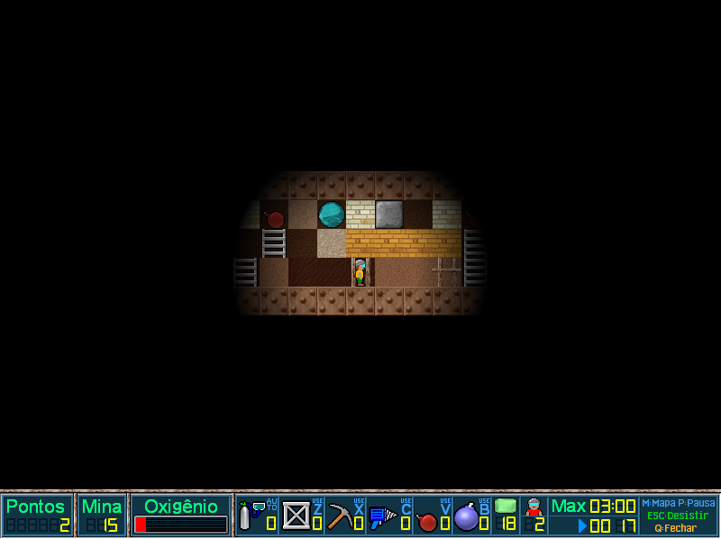
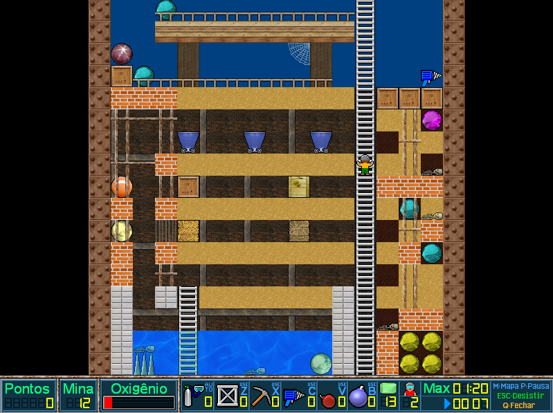

# FreeBASIC Miner

## Overview

FreeBASIC Miner is a game written in FreeBASIC, for the Windows platform, by [niz567](https://freebasic.net/forum/memberlist.php?mode=viewprofile&u=4995).

The original program has been modified by members of the [FreeBASIC forum](https://www.freebasic.net/forum/viewtopic.php?f=3&t=28828) so that it can be compiled for Linux.

## Screenshots

## Credits

The new version of FreeBASIC Miner uses [FBSound](https://www.freebasic.net/forum/viewtopic.php?f=14&t=27272).

The sound effects come from [The Essential Retro Video Game Sound Effects Collection](https://opengameart.org/content/512-sound-effects-8-bit-style).

The screenshots used in this document come from the magazine [BASIC Gamer](http://games.freebasic.net/BASICGaming/Issue2/index.html#review1).
